# Thiết bị hiện có

Danh sách linh kiện và dụng cụ đang sở hữu. Cập nhật khi mua thêm.

Ảnh thực tế: thư mục [photos/](photos/)

**Quy ước:** có ảnh trong `photos/` = đang có. **Không có ảnh = chưa mua** (kể cả khi kit ghi trên hộp). Khi mua xong → chụp → thêm ảnh → chuyển từ mục “Chưa có” sang đây.

---

## Dụng cụ đo

| Thiết bị | Ảnh | Ghi chú |
|----------|-----|---------|
| Đồng hồ vạn năng **ANENG DT9205A** | 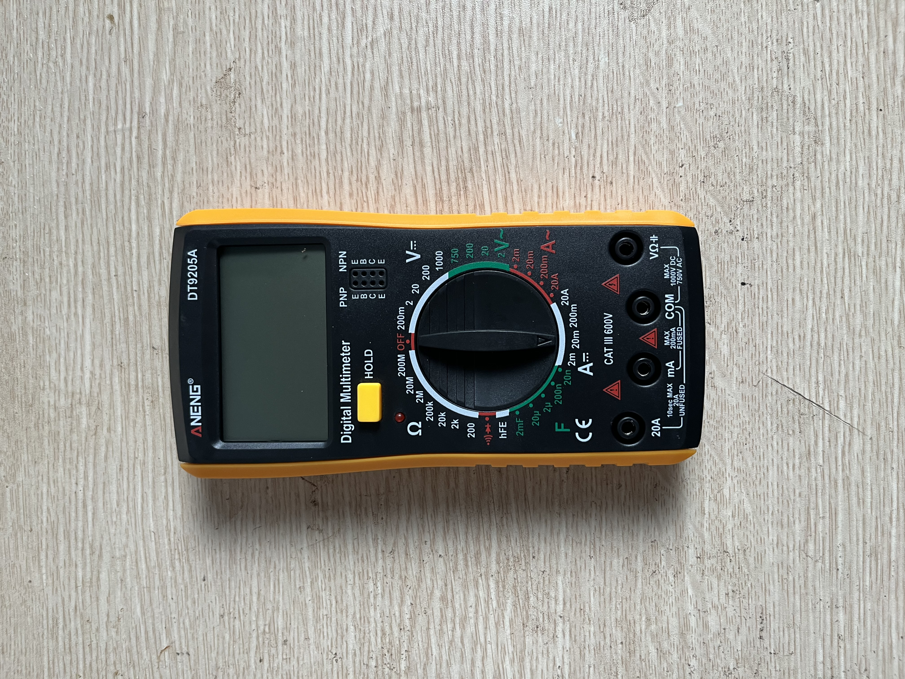 | Đo điện trở, điện áp DC, continuity trước khi nối mạch |

---

## Linh kiện riêng (ngoài kit)

| Thiết bị | Số lượng | Ảnh | Ghi chú |
|----------|----------|-----|---------|
| Servo **SG90** | 2 | 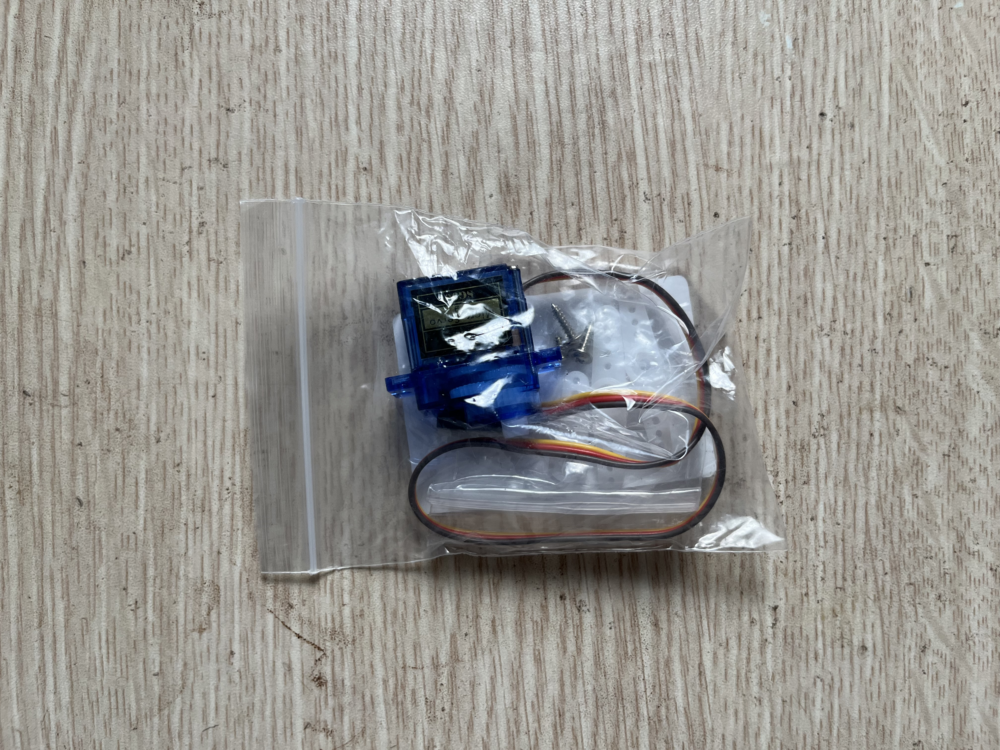 | Micro servo 9g, 3 dây (GND / VCC 5V / Signal PWM). Ảnh: 1 con kèm sừng servo & ốc |
| Set điện trở màng kim loại | 600 cái (30 loại × 20) | 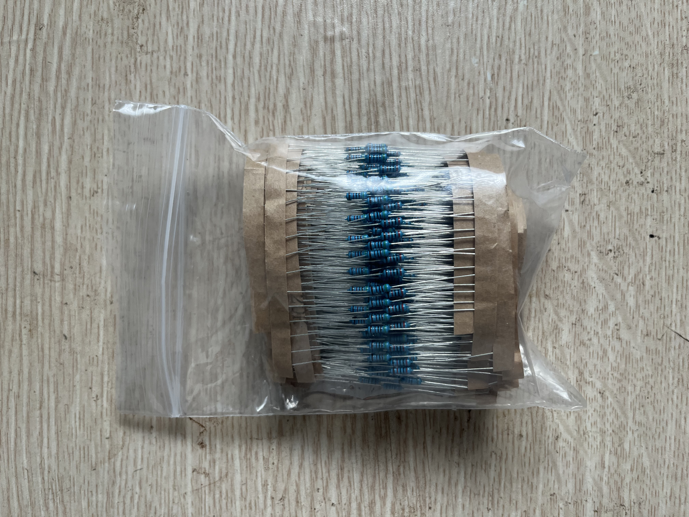 | 1%, 1/4W, dải 10Ω–1MΩ (xem bảng giá trị bên dưới) |

### Giá trị điện trở trong set 600

```
10Ω   22Ω   47Ω   100Ω  150Ω  200Ω  220Ω  270Ω  330Ω
470Ω  510Ω  680Ω  1KΩ   2KΩ   2.2KΩ 3.3KΩ 4.7KΩ
5.1KΩ 6.8KΩ 10KΩ  20KΩ  47KΩ  51KΩ  68KΩ  100KΩ
220KΩ 300KΩ 470KΩ 680KΩ 1MΩ
```

---

## ESP32 Starter Kit

### Board & nền tảng

| Thiết bị | Số lượng | Ảnh |
|----------|----------|-----|
| Board **ESP32 DevKit V1** (30 chân) | 1 | 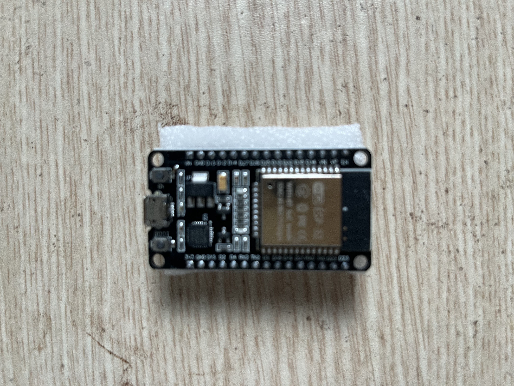 |
| Breadboard **MB102** | 1 |  |
| Module nguồn breadboard **MB102** | 1 | 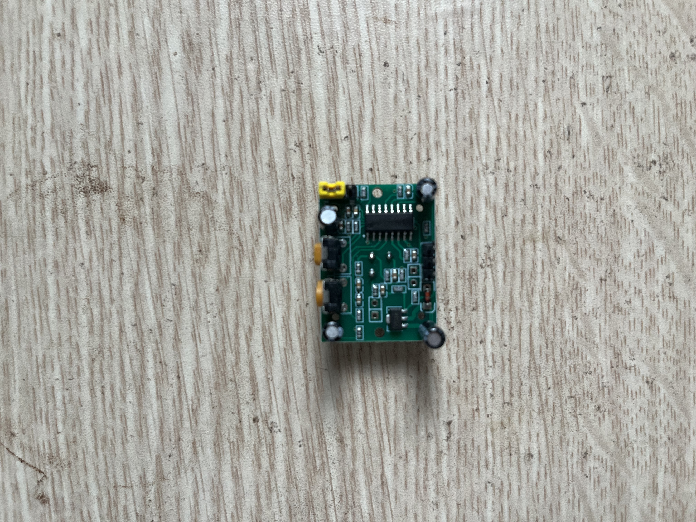 |
| Cáp USB Micro (nạp code) | 1 | 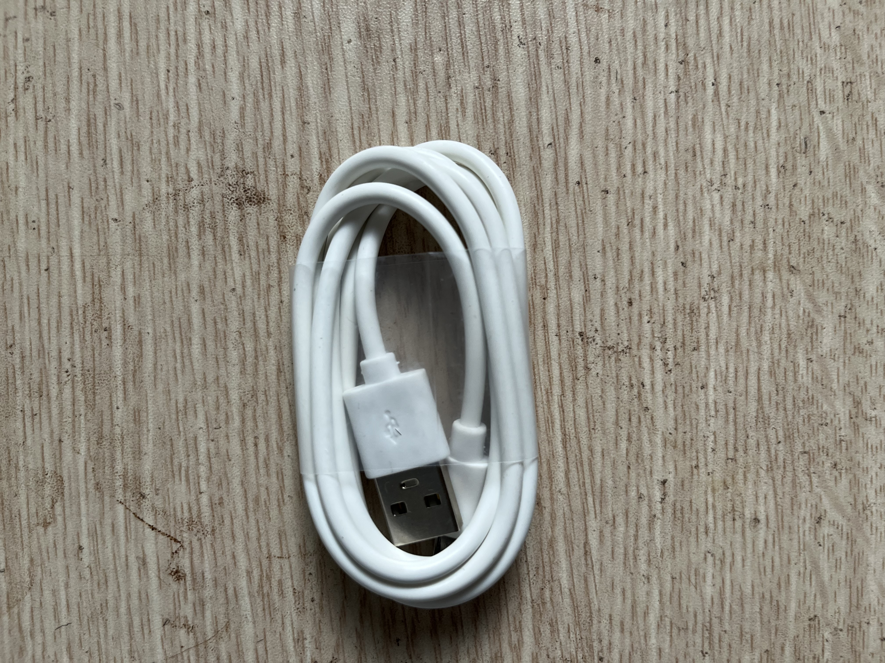 |

### Màn hình & cảm biến

| Thiết bị | Số lượng | Ảnh | Giao tiếp / ghi chú |
|----------|----------|-----|---------------------|
| OLED **0.96 inch** (GM009605 v4.3) | 1 | 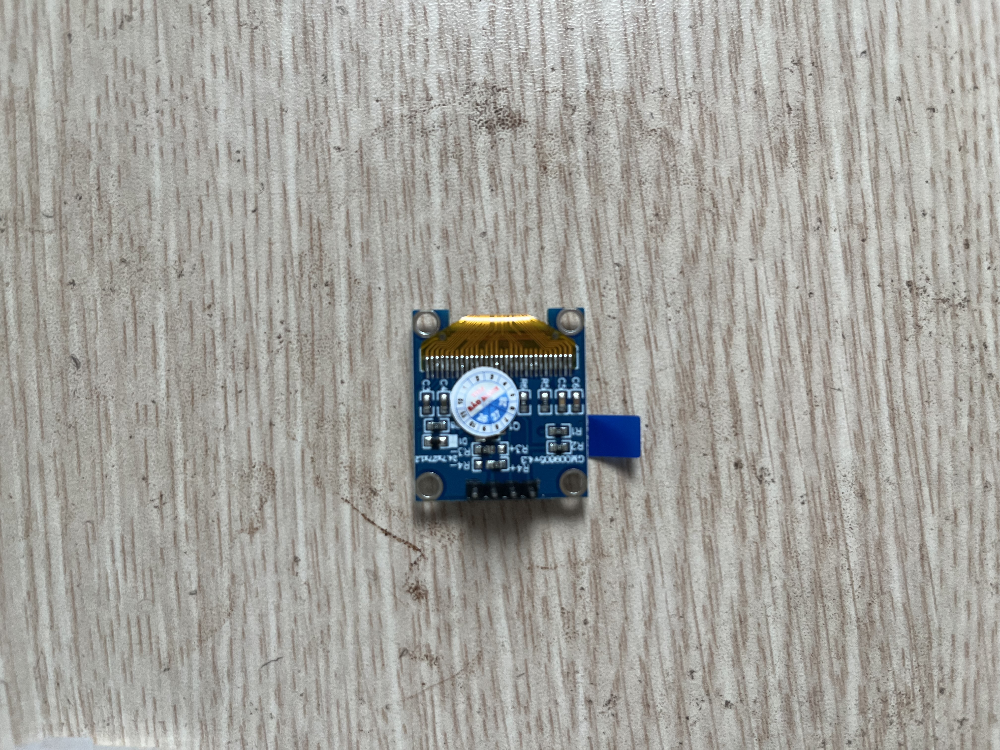 | I2C — GND, VCC, SCL, SDA |
| Module quang trở (LDR) | 1 |  | VCC, GND, DO, AO |
| Module nhiệt độ & độ ẩm **DHT11** | 1 | 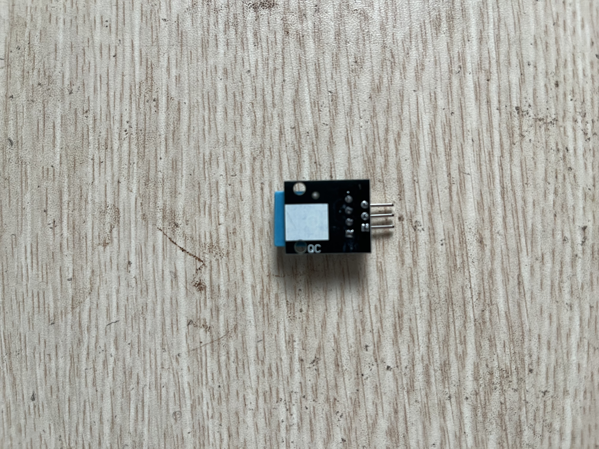 | Digital 1-wire |
| Module tránh vật cản **LM393** (IR) | 1 | 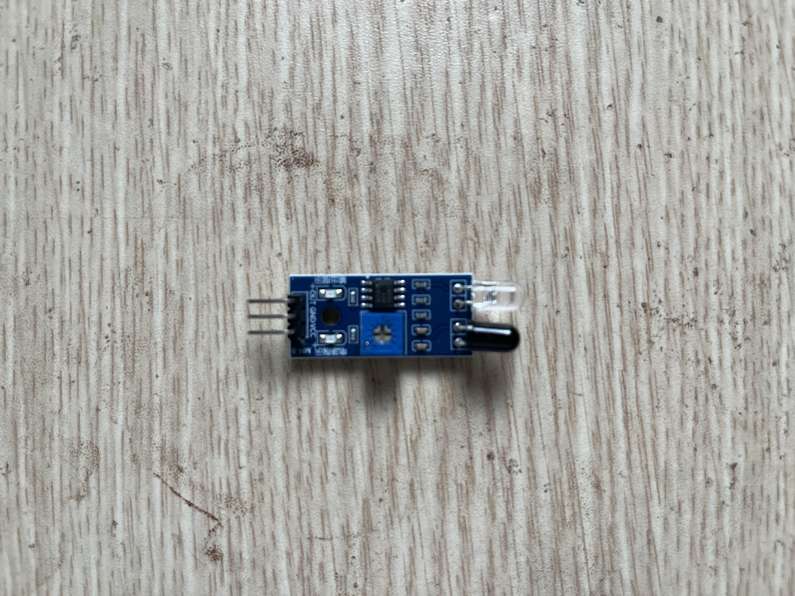 | Digital — VCC, GND, OUT |

### Linh kiện cơ bản

| Thiết bị | Số lượng | Ảnh |
|----------|----------|-----|
| Biến trở **10K** | 1 | 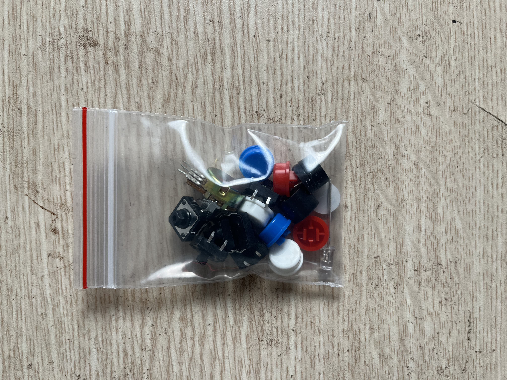 *(cùng túi với nút bấm)* |
| Nút nhấn **12×12** + nắp màu | 6 |  |
| LED đỏ / vàng / xanh lục | 5 + 5 + 5 | 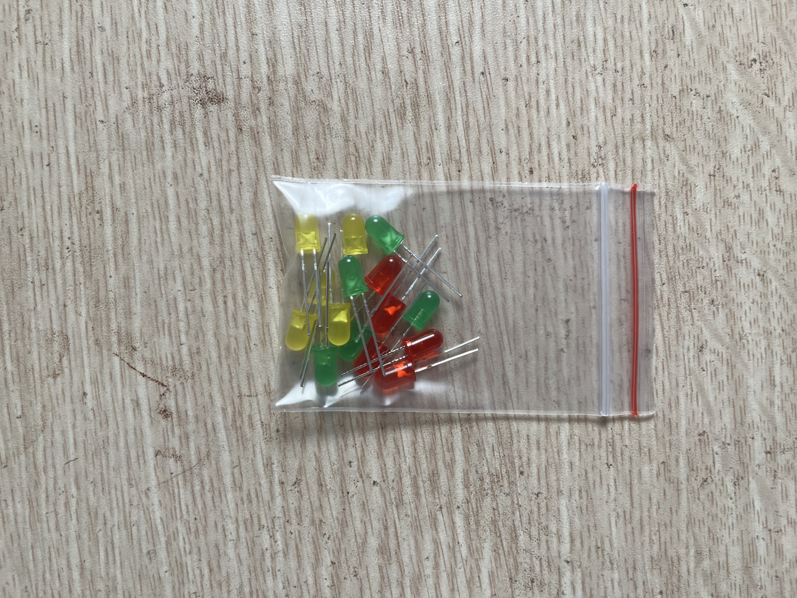 |
| Điện trở lẻ 220Ω / 1K / 10K | — |  | Lấy từ set 600 |
| Module relay **2 kênh 5V** (SONGLE SRD-05VDC-SL-C) | 1 | 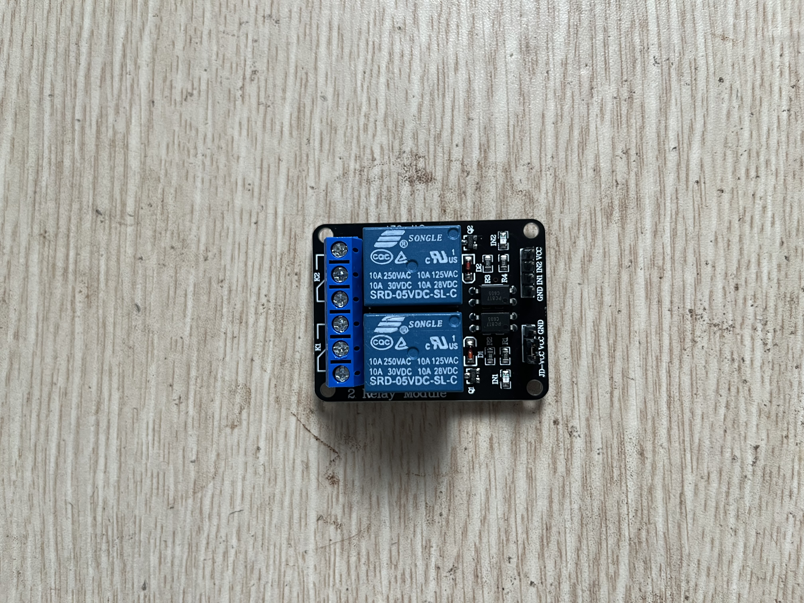 |

### Dây nối

| Loại dây | Số lượng | Ảnh |
|----------|----------|-----|
| Đực – Cái | 10 | 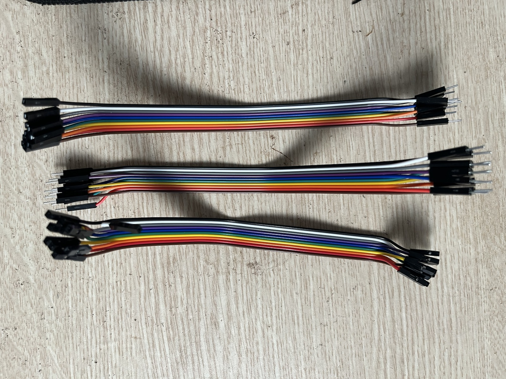 |
| Cái – Cái | 10 |  |
| Đực – Đực | 10 |  |

---

## Chưa có — cần mua

| Thiết bị | Dùng cho |
|----------|----------|
| Module chuyển động **PIR HC-SR501** | P4b |
| LED **RGB** | Bài mở rộng |
| Buzzer thụ động / hoạt động | P10, P4b (báo động) |
| DC motor × 2 | P11, P18 — truyền động bánh xe |
| Motor driver (L298N / TB6612) | P11, P18 — ESP32 không đủ dòng motor |
| Khung xe 2 bánh + bánh | P18 |
| Pin Li-ion/LiPo 2S + sạc + BMS | P18 — nguồn di động |
| Buck converter 5V | Hạ áp pin xuống 5V/3.3V |
| Stepper motor + driver A4988/DRV8825 | P15 |
| Encoder | P16, P17 |
| MOSFET module | P13 |
| Cảm biến siêu âm HC-SR04 | P19 (có thể dùng LM393 tạm thời) |

---

## Ghi chú an toàn

- ESP32 GPIO chỉ chịu **3.3V** — không cấp 5V trực tiếp vào chân tín hiệu.
- Servo SG90 lấy **5V** riêng; **GND phải nối chung** với ESP32.
- 2 servo chạy cùng lúc: dùng nguồn 5V riêng (≥ 1A), không kéo hết từ chân 3.3V/5V mỏng của board.

---

## Index ảnh

| File | Linh kiện |
|------|-----------|
| `multimeter-dt9205a.jpg` | Đồng hồ vạn năng ANENG DT9205A |
| `set-dien-tro-600-metal-film.jpg` | Set 600 điện trở màng kim loại |
| `board-esp32-devkit-v1.jpg` | Board ESP32 DevKit V1 (ESP-WROOM-32) |
| `module-relay-2-kenh-5v.jpg` | Module relay 2 kênh 5V |
| `module-lm393-tranh-vat-can.jpg` | Module tránh vật cản IR (LM393) |
| `module-dht11.jpg` | Module DHT11 |
| `servo-sg90.jpg` | Servo SG90 + phụ kiện |
| `led-5mm-do-vang-xanh.jpg` | LED 5mm (5 đỏ + 5 vàng + 5 xanh) |
| `nut-bam-12x12-bien-tro-10k.jpg` | Nút 12×12, nắp nút, biến trở 10K |
| `module-quang-tro-ldr.jpg` | Module quang trở LDR |
| `cap-usb-micro.jpg` | Cáp USB Micro |
| `oled-096-inch-i2c.jpg` | OLED 0.96" I2C |
| `breadboard-mb102.jpg` | Breadboard MB102 |
| `module-nguon-breadboard-mb102.jpg` | Module nguồn gắn breadboard MB102 |
| `jumper-wires.jpg` | Dây jumper Đực–Cái, Cái–Cái, Đực–Đực |
